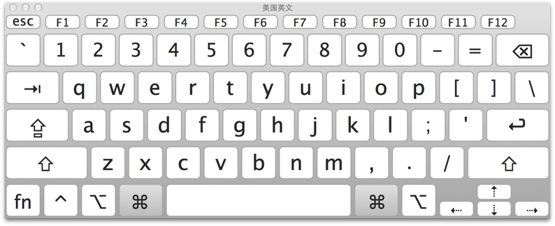
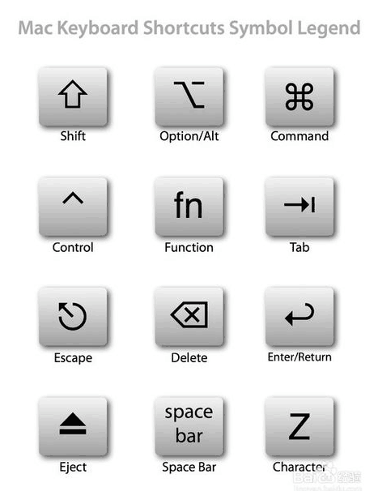

## mac keyboard

## mac machine
### mac 快捷键的图形符号

#### 基本的快捷键
1. 基本操作  
  command + z : 撤销  
  command + x : 剪切  
  command + c : 拷贝  
  command + v : 粘贴  
  command + a : 全选  
  command + s : 保存  
  command + f : 查找  

2. 截图  
  command + shift + 4 : 截取所选屏幕区域到一个文件  
  command + shift + 3 : 截取全部屏幕到文件  
  command + shift + control + 3 : 截取全部屏幕到剪贴板  
  command + shift + 4 : 截取所选屏幕区域到一个文件，或按空格键仅捕捉一个窗口  
  command + shift + control + 4 : 截取所选屏幕区域到剪贴板，或按空格键仅捕捉一个窗  

3. 应用程序  
  command + option + esc : 打开强者退出窗口  
  command + h : 隐藏当前正在运行的应用程序窗口  
  command + option + h : 隐藏其他应用程序窗口  
  command + q : 退出最前面的应用程序  
  command + shift + z : 重做，即撤销的逆向操作  
  command + tab : 应用程序切换  

4. 文本处理    
  command + B : 所选文字粗体显示  
  fn + 上箭头 : page up  
  fn + 下箭头 : page down  
  fn + 左箭头 : 滚动之文稿开头  
  fn + 右箭头 : 滚动至文稿末尾  
  command + 右箭头 : 将光标移至当前行的行首  
  command + 左箭头 : 将光标移至当前行的行尾  
  command + 下箭头 : 将光标移至文稿末尾  
  command + 上箭头 : 将光标移至文稿开头  
  option + 右箭头 : 将光标移至下一个单词的末尾  
  option + 左箭头 : 将光标移至下一个箭头的开头  
  control + a : 移至行或段落的开头  

5. Finder中  
  command + option + v : 剪切文件  
  command + c : 粘贴文件  
  command + shift + n : 新建文件夹  
  command + shift + g : 调出窗口，可输入绝对路径直达文件夹  
  return : 在点击选中文件的情况下，按下可重命名文件  
  command + o : 打开所选项  
  command + 上箭头 : 打开包含当前文件夹的文件夹  
  command + delete : 将文件移至废纸篓  
  command + shift + delete : 清空废纸篓  
  空格键 : 快速查看选中的文件  

6. 浏览器中  
  control + tab : 转向下一个标签页  
  command + l : 光标直接跳至地址栏  
  control + shift + tab : 转向上一个标签页  
  command + +/= : 放大页面  
  command + - : 缩小页面  
  command + [ : show the previous page  
  command + ] : show the next page  

7. dictionary  
  aption + esc : 单词发音  
    

## sublime3
- ctrl + alt + o: preview markup in browser