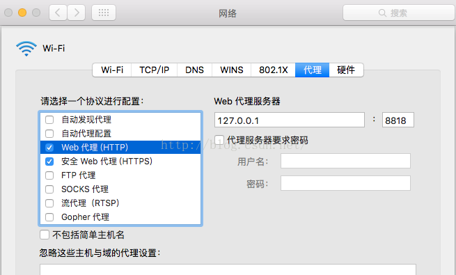

# Mac上Privoxy将shadowsocks的socks5代理转为http代理(解决SublimeText无法安装插件的问题)

## 背景

shadowsocks虽然用着很爽，但是不是万能的。原因是他是sock5代理，属于局部代理。一些软件根本不支持socks5代理，如AS的gradle，eclipse等均不支持。AndroidStudio本身支持socks5代理，但是那个gradle只支持http代理。另外，还有一个误区，将shadowsocks的全局代理打开就能代理所有请求，这是一种错误的认识。全局和局部，有个前提那就是使用了socks5代理，也即使用了shadowsocks，在此基础上根据pac规则，加上你选择的模式决定是否要用shadowsocks这个梯子。一般而言，我门的浏览器都是默认支持socks5. 对于不支持socks5的，可以使用Privoxy！

## 安装

安装可以通过 `brew install privacy`，也可以访问官网再跳转到 source forge 上下载：[https://sourceforge.net/projects/ijbswa/files/](https://sourceforge.net/projects/ijbswa/files/) 。

## 启动

安装完毕后在 /Applications/Privoxy/ 目录可以看到 startPrivoxy.sh 和 stopPrivoxy.sh 两个脚本，通过以下两个命令开启或关闭：

打开：`sudo /Applications/Privoxy/startPrivoxy.sh`

关闭：`sudo /Applications/Privoxy/stopPrivoxy.sh`

## 配置关联shadowsocks

privoxy 的配置文件在 /usr/local/etc/privoxy 目录下的 config 文件，找到

```
#        forward-socks5t   /            127.0.0.1:9050
```

在上面加一句即：

```
forward-socks5    /               127.0.0.1:1080
```

这句话表示将所有请求通过socks5中转，而127.0.0.1:1080正是shadowsocks本地监听的地址和端口。如果你的ss的本地端口不是1080，此处要做对应修改，保持一致。如果你只想在本地电脑使用privoxy，那么通过这么配置已经ok了。如果你希望局域网里其他终端通过http代理使用privoxy，搜索关键字：listen,最终找到：

```
listen-address  127.0.0.1:8118
```

上面这个表示privoxy监听本地的8118端口。将其改为：

```
listen-address  0.0.0.0:8118
```

即可监听局域网内所有请求。

## 配置其他软件使用http代理

### SublimeText3

在 Preference－PackageSettings－Package Control－Settings User 里，加入这样两句：

```
"http_proxy": "http://127.0.0.1:8118",
"https_proxy": "http://127.0.0.1:8118"
```

### Git

设置http代理：

```
git config --global https.proxy http://127.0.0.1:8118
git config --global https.proxy https://127.0.0.1:8118
```


取消http代理：

```
git config --global --unset http.proxy
git config --global --unset https.proxy
```

**备注1**

git是可以直接支持socks5代理的，如果只安装了shadowsocks，而不安Privoxy设置方法如下：

```
git config --global http.proxy 'socks5://127.0.0.1:1080' 
git config --global https.proxy 'socks5://127.0.0.1:1080'
```

**备注2**

关于git设置http代理，不用使用git config，可以直接在shell里设置，之后在shell里的操作（当然包括git）都会走代理：

```
export http_proxy=http://127.0.0.1:8118  
export https_proxy=http://127.0.0.1:8118  
```

## Privoxy代理所有请求

我们用 shadowsocks 时，即使有时候设置了全局代理，但是发现还是有很多软件访问不了国外的网站，那是因为不是所有的软件都支持 sock5 代理，所有才需要 Privoxy 将 sock5 转化为 http 代理。

直接设置wifi的http和https代理即可, Privoxy功能还是很强大的，非局限于本文所述,官网上的一句话：

```
Privoxy is a non-caching web proxy with advanced filtering capabilities for enhancing privacy, modifying web page data and HTTP headers, controlling access, and removing ads and other obnoxious Internet junk. Privoxy has a flexible configuration and can be customized to suit individual needs and tastes. It has application for both stand-alone systems and multi-user networks.
```


