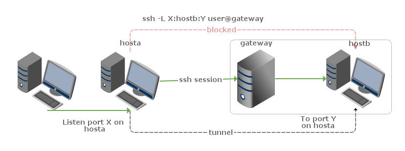
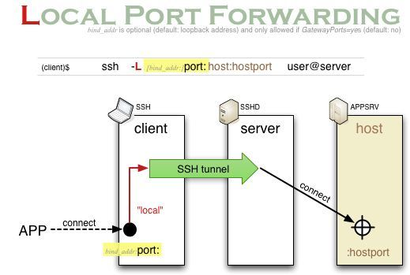
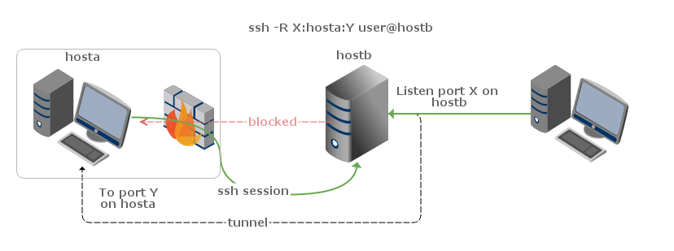
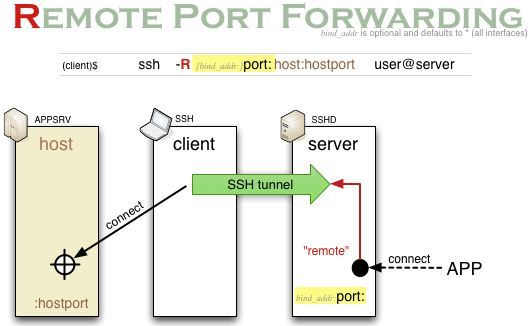
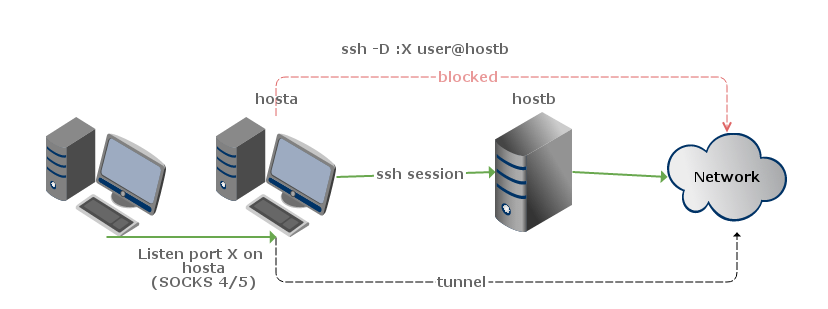

# SSH端口转发（隧道）

大家都知道SSH是一种安全的传输协议，用在连接服务器上比较多。不过其实除了这个功能，它的隧道转发功能更是吸引人。

那么，何谓 SSH 隧道呢？隧道是一种把一种网络协议封装进另外一种网络协议进行传输的技术。这里我们研究 ssh 隧道，所以所有的网络通讯都是加密的。又被称作端口转发，因为 ssh 隧道通常会绑定一个本地端口，所有发向这个端口端口的数据包，都会被加密并透明地传输到远端系统。

基于SSH的端口转发可分为三类，分别为：本地端口转发，远程端口转发，动态端口转发。

首先，认识下这三个非常强大的命令：
```
ssh -C -f -N -g -L listen_port:DST_Host:DST_port user@Tunnel_Host 
ssh -C -f -N -g -R listen_port:DST_Host:DST_port user@Tunnel_Host 
ssh -C -f -N -g -D listen_port user@Tunnel_Host
```

相关参数的解释： 
```
-f Fork into background after authentication. 
告诉SSH客户端在后台运行

-L port:remote_host:remote_port 
connections from the SSH client are forwarded via the SSH server, then to a destination server
将本地机(客户机)的某个端口转发到远端指定机器的指定端口. 工作原理是这样的, 本地机器上分配了一个 socket 侦听 port 端口, 一旦这个端口上有了连接, 该连接就经过安全通道转发出去, 同时远程中间主机(ssh server)将和 remote_host(远端指定的机器) 的 remote_port 端口建立连接. 可以在配置文件中指定端口的转发. 只有 root 才能转发特权端口. IPv6 地址用另一种格式说明: port/host/hostport

-R port:host:hostport 
connections from the SSH server are forwarded via the SSH client, then to a destination server
将远程主机(服务器)的某个端口转发到本地端指定机器的指定端口. 工作原理是这样的, 远程主机上分配了一个 socket 侦听 port 端口, 一旦这个端口上有了连接, 该连接就经过安全通道转向出去, 同时和本地主机 host 的 hostport 端口建立连接. 可以在配置文件中指定端口的转发. 只有用 root 登录远程主机才能转发特权端口. IPv6 地址用另一种格式说明: port/host/hostport

-D port 
This works by allocating a socket to listen to port on the local 
 side, and whenever a connection is made to this port, the con- 
 nection is forwarded over the secure channel, and the applica- 
 tion protocol is then used to determine where to connect to from 
 the remote machine.  Currently the SOCKS4 and SOCKS5 protocols 
 are supported, and ssh will act as a SOCKS server.  Only root 
 can forward privileged ports.  Dynamic port forwardings can also 
 be specified in the configuration file.
指定一个本地机器 “动态的’ 应用程序端口转发. 工作原理是这样的, 本地机器上分配了一个 socket 侦听 port 端口, 一旦这个端口上有了连接, 该连接就经过安全通道转发出去, 根据应用程序的协议可以判断出远程主机将和哪里连接. 目前支持 SOCKS4/5 协议, 将充当 SOCKS4/5 服务器. 只有 root 才能转发特权端口. 可以在配置文件中指定动态端口的转发.
而这里需要值得注意的是，此时 SSH 所包护的范围只包括从浏览器端（SSH Client 端）到 SSH Server 端的连接，并不包含从 SSH Server 端 到目标网站的连接。如果后半截连接的安全不能得到充分的保证的话，这种方式仍不是合适的解决方案。

-C Enable compression. 
压缩数据传输

-N Do not execute a shell or command. 
告诉SSH客户端，这个连接不需要执行任何命令。仅仅做端口转发

-g Allow remote hosts to connect to forwarded ports. 
```

## 本地端口转发

`ssh -L <local port>:<remote host>:<remote port> <SSH server hostname>`
将指定本地（客户端）端口转发至远程端口上.



ssh client: hosta
ssh server: gateway

hosta无法直接访问hostb，但它能直接SSH登录gateway；如此通过gateway，将hosta的端口X转发至hostb的端口Y上。相当于端口X和端口Y之间建立了加密隧道。

一般来说，端口Y为hostb上某服务的监听端口。当建立隧道后，hosta将监听端口X。应用程序访问hosta的端口X，等同于访问hostb的端口Y。对于应用程序，hostb端口Y对应的服务就如同运行在hosta上。

日常工作中，客户的网络常由于信息安全而被网关（或防火墙）隔离。当我们的软件在客户网络中某服务器发生问题时，我们常需奔赴客户现场进行调试。若客户存在某机器安装了SSH服务器，且能被外部访问。就可以利用SSH正向代理的方法，快速简便的登录被隔离的服务器并进行应用调试。



## 远程端口转发

`ssh -R <local port>:<remote host>:<remote port> <SSH server hostname>`
将指定远程端口转发至本地（客户端）端口上.



ssh client: hosta
ssh server: hostb

hosta 在防火墙内，无法被 hostb 直接访问。但它能直接 SSH 登录 hostb；如此通过 hostb，将 hostb 的端口 X 转发至 hosta 的端口 Y 上。该方法与 SSH 正向代理类似，所不同的是该隧道的访问方向是从服务端（hostb）至客户端 (hosta），故被称为反向代理。

其应用场景也与 SSH 正向代理类似，所不同的是若客户不存在可供外部访问的 SSH 服务器时，我们可以在外网建设一个 SSH 服务器给客户的被隔离服务器来建立隧道。如此，我们可以访问自己的 SSH 服务器对应端口来调试客户服务器的应用。



## 动态端口转发

相对于 **本地转发和远程转发的单一端口转发模式** 而言，**动态转发有点更加强劲的端口转发功能，即是无需固定指定被访问目标主机的端口号。这个端口号需要在本地通过协议指定，该协议就是简单、安全、实用的 SOCKS 协议。**

`-D [bind_address:]port ssh_server_user@ssh_server_ip`
Dynamic port forwarding turns your SSH client into a SOCKS proxy server. Each program that uses the proxy server needs to be configured specifically, and reconfigured when you stop using the proxy server.
利用远程服务器为访问出口，在本地建立SOCKS 4/5代理服务器。本地的 port 端口就是一个SOCKS代理了。



该功能广为人知的应用场景为翻墙。如上图，在国外租用VPS（hostb），客户端（hosta）通过SSH动态代理端口X（SOCKS 4/5的端口）便可以访问被GFW封锁的网络。

